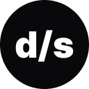

<h1 align="center">
    
</h1>

<p align="center">
A devstore é um e-commerce, onde foi utilizado o Next.js 14, com o uso de estruturas AppRouter junto ao conceitos de Client Components e Server Components.<br/>
</p>

<p align="center">
  <a href="#-tecnologias">Tecnologias</a>&nbsp;&nbsp;&nbsp;|&nbsp;&nbsp;&nbsp;
  <a href="#-projeto">Projeto</a>&nbsp;&nbsp;&nbsp;|&nbsp;&nbsp;&nbsp;
  <a href="#-layout">Layout</a>&nbsp;&nbsp;&nbsp;|&nbsp;&nbsp;&nbsp;
  <a href="#memo-licença">Licença</a>
</p>

<p align="center">
  
</p>

<br>

<p align="center">
  
</p>

## 🚀 Tecnologias

Esse projeto foi desenvolvido com as seguintes tecnologias:

- HTML, CSS e JavaScript
- Git e Github
- Figma
- Biblotecas:

  - [ReactJs](https://pt-br.reactjs.org/)
  - [NextJs 14](https://nextjs.org/)
  - [TypeScript](https://www.typescriptlang.org/)
  - [TailwindCSS](https://tailwindcss.com/)
  - [zod](https://zod.dev/)
  - [Cypress](https://www.cypress.io/)


## 💻 Projeto

A devstore é uma loja online para venda de roupas. Este projeto serviu de base para aprender os fundamentos das features do  ```Next.js 14```, junto ao conceitos de AppRouter, Client Components e Server Components 💡.

- [Visite o projeto online](https://devstore-rouge.vercel.app/)

## 🔖 Layout

Você pode visualizar o layout do projeto através [deste link 👋](https://www.figma.com/file/Vd1ordH9IY12zIAHz33Fjk/devstore-%E2%80%A2-Projeto-React-(Community)?type=design&node-id=0%3A1&mode=design&t=ObFH1WyJJv7QyDh7-1). É necessário ter conta no [Figma](https://figma.com) para acessá-lo.

## :memo: Licença

Esse projeto está sob a licença MIT.

---

## ✍ Author
<br>


<p>
    Made with 💜 by Pedro Henrique Klein
</p>
<p align="left">
    <a href="https://www.linkedin.com/in/pedro-klein/" target="_blank">
        
    </a>
    <a href="mailto:pedro.klein.sl@gmail.com" target="_blank">
        
    </a>
</p>